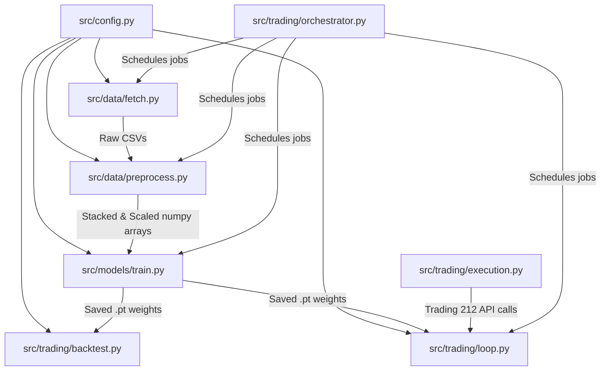

# 🌲 Multi-Asset Conditional Trading Bot: Agent Transfer README

This document serves as a comprehensive, self-contained guide designed to let any developer or subsequent AI agent (such as Claude, Gemini, or GPT-4) immediately understand this codebase, its architecture, and the exact next steps needed to complete and verify the project.

---

## 🎯 Project Overview & Core Goals

The target of this project is a **fully autonomous, 24/7 self-training and executing trading bot** operating on the **Trading 212 API**. It utilizes a custom Deep Learning model—specifically an **LSTM with an Attention mechanism**—that performs multi-asset portfolio trading.

### Key Advanced Features:
1. **Multi-Asset Generalization**: Instead of overfitting to a single stock, the bot trains on a diverse **12-asset portfolio** containing Exchange Traded Funds (ETFs), Tech/Mega Caps, and Consumer/Value stocks.
2. **Conditional Architecture (Categorical Learning)**: Rather than running separate models, the model utilizes a **conditional inputs architecture**. A 3-dimensional one-hot encoded vector representing the asset's category (`ETF`, `Tech`, `Consumer`) is appended to each input sequence. This allows a single, unified LSTM model to dynamically learn and adjust its weights for different asset behaviors.
3. **Dividend-Aware Profit & Prediction**: Historical dividend payouts are tracked and fed into the model as an active feature. In backtesting, if an asset pays a dividend, it is multiplied by the held shares and added to `free_cash` (representing total return profit).
4. **Gaussian Uncertainty Prediction**: The model outputs two values: predicted return ($\mu$) and learned uncertainty ($\sigma^2$), optimized via a Gaussian Negative Log-Likelihood (Gaussian NLL) loss. It only places trades when confidence is high (confidence threshold vs. predicted standard deviation).
5. **24/7 Production Scheduler**: An orchestrator schedules daily trading signals at Nasdaq Open (9:35 AM EST, Mon–Fri) and weekly model self-retraining (12:00 AM Saturdays).

---

## 📂 Codebase Architecture & File Mapping

All project logic lives inside the `/src` folder. Here is how the files are structured and how they interact:



### Module Descriptions:

1. **`src/config.py`**:
   - Centralizes project constants.
   - Maps the 12 portfolio tickers to their category mappings:
     - **ETFs (`ETF`)**: `SPY`, `VWRL.L`, `IWY`, `AIQ`
     - **Mega Caps (`Tech`)**: `MSFT`, `TSLA`, `ASML`, `META`, `GOOGL`
     - **Value Stocks (`Consumer`)**: `MCD`, `COST`, `YUM`
   - Defines the categories: `CATEGORIES = ["ETF", "Tech", "Consumer"]`
   - Maps ticker symbols to active Trading 212 instrument IDs (e.g., `SPY` -> `SPY_US_EQ`).
   - Configures prediction profiles (currently `next_day`: 60-day history window, predicting 1 day ahead).

2. **`src/data/fetch.py`**:
   - Downloads 10-year historical daily bars for all 12 assets via `yfinance`.
   - Uses `actions=True` to fetch corporate actions (capturing raw `Dividends` history).
   - Stores raw data as CSVs in `data/raw/`.

3. **`src/data/preprocess.py`**:
   - Computes technical indicators (SMA, RSI, MACD, Bollinger Bands, ATR, Volatility).
   - Cleans and aligns target future returns (`Target_Return` shifted 1 interval ahead, scaled by 100).
   - Sets up one-hot columns: `Category_ETF`, `Category_Tech`, `Category_Consumer` (equal to 1.0 if matching the asset category, 0.0 otherwise).
   - Combines numeric features with unscaled one-hot vectors.
   - Fits and saves a global `StandardScaler` on the stacked training split across all assets.
   - Generates sliding sequences of size `(seq_length, 11)`—where **11** is the total feature count (8 numeric indicators + 3 category one-hot tags).
   - Stacks and shuffles all asset sequences to construct a generalized dataset:
     - **Training Set (`X_train.npy`, `y_train.npy`)**: **19,770 sequences** (shape `(19770, 60, 11)`)
     - **Validation Set (`X_val.npy`, `y_val.npy`)**: **3,671 sequences** (shape `(3671, 60, 11)`)
   - Saves individual test arrays per-ticker (e.g., `SPY_X_test.npy`, `MSFT_X_test.npy`) for exact asset backtesting.

4. **`src/models/train.py`**:
   - Defines the `Attention` block and the dual-headed `LSTMAttention` model.
   - Custom training loop optimizing a `GaussianNLLLoss`.
   - Integrated **Optuna hyperparameter tuning** (currently set to 3 trials to complete quickly on CPU).
   - Trains the final model using the best-performing parameters, saving the model `.pt` weights and hyperparameter `.json` configs under `models/saved/`.

5. **`src/trading/backtest.py`**:
   - SIMULATES trading over the historical test split (Feb 2025 – May 2026).
   - Incorporates real **dividend payout tracking**: on days when a stock distributes a dividend, it adds `held_shares * dividend_per_share` directly to `free_cash` and logs it as profit.
   - Handles multi-asset evaluation by feeding the correct category one-hot vector alongside sequence features.
   - Compares performance of five distinct strategies:
     - **Advanced AI** (champion strategy: uses dual-headed model predictions to enter trades, takes 30% partial profit when close price hits entry + 20, executes 30% time-delayed downside exits exactly 2 days after high-confidence downside warning signals, and exits remaining shares at day 5)
     - **AI Model** (standard single-stage prediction exits)
     - **RSI + BB Mean Reversion**
     - **PnL Box** (3% Take Profit / 1.5% Stop Loss)
     - **SMA Crossover** (Trend)

6. **`src/trading/loop.py`**:
   - Live trading module that executes trades on Trading 212.
   - Downloads live price history dynamically to rebuild the 11-feature input tensor.
   - Fetches available account cash, calculates target order quantities, and submits orders.
   - Formulates trading actions for all assets in the active watch list.

7. **`src/trading/execution.py`**:
   - Standard REST client layer interacting directly with the Trading 212 API.

8. **`src/trading/orchestrator.py`**:
   - Production system wrapper. Schedules jobs:
     - **Daily (9:35 AM EST, Mon–Fri)**: Fetches bar data, processes indicators, executes `loop.py` trading orders.
     - **Weekly (Saturdays 12:00 AM EST)**: Downloads full fresh history, processes dataset, and retrains the model.

---

## 📈 Status of Current Operations

- **Current Active Branch**: `feature/multi-asset-dividends` (all code updates are completed but uncommitted/unmerged).
- **Background Task (`task-815`)**: Currently running `python src/models/train.py` under the `feature/multi-asset-dividends` branch.
- **Tuning Profile**: Reduced Optuna search space to **3 trials** to ensure it finishes quickly on CPU.
- **Model Output**: Once the training task completes, a fresh timestamped model file (e.g., `model_next_day_20260523_16XXXX.pt`) and parameter configuration (e.g., `model_next_day_20260523_16XXXX_params.json`) will be generated inside `models/saved/`.

---

## ⚠️ Crucial Integration & API Gotchas (Must Read!)

If you modify or expand the trading/execution layers, keep these critical details in mind:

1. **Trading 212 Order Quantities**:
   - The API will raise a **`400 quantity-precision-mismatch`** error if the ordered share quantity has high fractional precision.
   - **Fix**: All order quantities must be rounded to exactly **2 decimal places** before submission (e.g., `round(qty, 2)`).
2. **Account Cash Balance Key**:
   - The API response from the `/equity/account/summary` endpoint does NOT contain a top-level `"free"` or `"cash"` key.
   - **Fix**: Parse cash using the nested dictionary structure: `response["cash"]["availableToTrade"]`.
3. **Category Vector Scaling**:
   - In `src/data/preprocess.py`, technical indicator data must be scaled (via `scaler.transform()`), but the category one-hot vector columns (`Category_ETF`, `Category_Tech`, `Category_Consumer`) must remain exactly `0` or `1`.
   - **Fix**: Scale numeric features first, and then horizontally stack (`np.hstack`) the unscaled one-hot category columns.

---

## 🚀 Exact Checklist for the Next Agent

Once your context is active, execute these steps in order to verify and lock in the release:

### 1. Wait/Monitor training completion
- Check if the training process is done:
  ```bash
  ps aux | grep train.py
  ```
- Alternatively, check if a new `.pt` model has been saved in `models/saved/`.

### 2. Run Multi-Asset Portfolio Backtest
Verify that our new conditional model is profitable across the full multi-asset test split (including dividend payouts):
```bash
python src/trading/backtest.py --ticker all --strategy ai --holding-days 5 --confidence-threshold 40
```
*Expected Output*: A simulated multi-asset backtest run printing out final returns, drawdowns, win rate, and total trades.

### 3. Dry-Run Active Trading Loop
Ensure `loop.py` builds live features (including category vectors and dividends) and queries Trading 212 smoothly:
```bash
python src/trading/loop.py --dry-run
```

### 4. Run Orchestrator Verification
Verify that the production system orchestrator jobs (both daily active pipeline and weekly training runs) execute flawlessly:
```bash
python src/trading/orchestrator.py --test-mode
```

### 5. Git Tree Clean-up & Milestone Release
After confirming everything works:
1. Stage and commit all files in the current branch:
   ```bash
   git add src/config.py src/data/fetch.py src/data/preprocess.py src/trading/backtest.py src/trading/loop.py
   git commit -m "Implement multi-asset conditional LSTM model with category one-hots and dividend tracking"
   ```
2. Checkout to `main` and merge:
   ```bash
   git checkout main
   git merge feature/multi-asset-dividends
   ```
3. Tag the new stable milestone:
   ```bash
   git tag v0.8.0
   ```
4. Push everything to GitHub:
   ```bash
   git push origin main --tags
   ```

---

*This guide ensures maximum continuity. Good luck with the next trading phase!*
