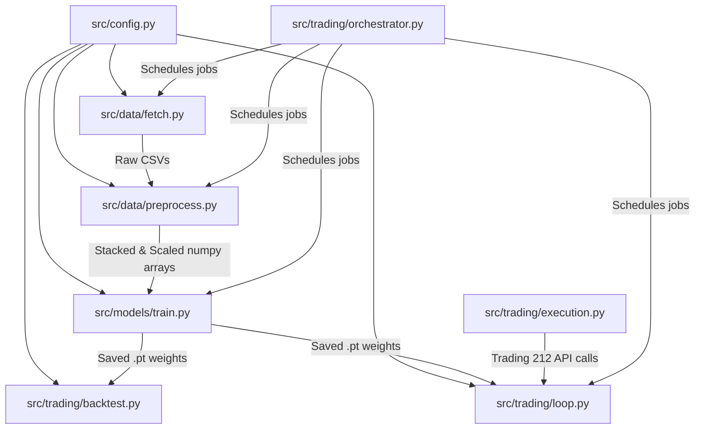

# 🌲 Multi-Asset Conditional Trading Bot: Agent Transfer README

This document serves as a comprehensive, self-contained guide designed to let any developer or subsequent AI agent (such as Claude, Gemini, or GPT-4) immediately understand this codebase, its architecture, and the exact next steps needed to complete and verify the project.

---

## 🎯 Project Overview & Core Goals

The target of this project is a **fully autonomous, 24/7 self-training and executing trading bot** operating on the **Trading 212 API**. It utilizes a custom Deep Learning model—specifically an **LSTM with an Attention mechanism**—that performs multi-asset portfolio trading.

### Key Advanced Features:
1. **Multi-Asset Generalization**: Instead of overfitting to a single stock, the bot trains on a diverse **12-asset portfolio** containing Exchange Traded Funds (ETFs), Tech/Mega Caps, and Consumer/Value stocks.
2. **Conditional Architecture (Categorical Learning)**: Rather than running separate models, the model utilizes a **conditional inputs architecture**. A 3-dimensional one-hot encoded vector representing the asset's category (`ETF`, `Tech`, `Consumer`) is appended to each input sequence. This allows a single, unified LSTM model to dynamically learn and adjust its weights for different asset behaviors.
3. **Dividend-Aware Profit & Prediction**: Historical dividend payouts are tracked and fed into the model as an active feature. In backtesting, if an asset pays a dividend, it is multiplied by the held shares and added to `free_cash` (representing total return profit).
4. **44-Feature Macro-Fundamental-Sentiment Pipeline**: Preprocessor extracts a highly comprehensive feature set consisting of 19 technical/price features, 7 FRED macroeconomic variables (Fed funds, 10Y Treasury, CPI, GDP, unemployment, oil, gold), 1 FX rate (GBPUSD=X), 10 fundamental ratios (PE, PB, ROE, D/E, EPS, etc.), 3 analyst/sentiment markers (consensuses, VADER news sentiment), and 3 category one-hot tags.
5. **GBP-Native Portfolio Backtesting with AER Bank Interest**: Backtest operates in **£5,000 GBP** native capital, handles GBP/USD FX translations on the fly, respects a **20% emergency cash reserve floor**, supports fractional shares, and pays daily accrued interest on cash balances matching historical annual equivalent rates (AER) (e.g. 4.75% for 2025, 4.5% for 2026).
6. **Personal AI Finance Advisor CLI**: Shipped a professional interactive advice CLI (`advisor.py`) that accepts custom horizons/historical simulated dates and displays highly readable holding-specific recommendations (staged buy/sell tranches, stop-loss targets, confidence tiers, and savings benchmark warnings).
7. **Self-Tuning Hyperparameter Optimization**: Orchestrated an automated tuning script (`auto_train.py`) that adaptively scales regularization and crash penalty factors across rolling validation windows to beat benchmark targets.
8. **24/7 Production Scheduler**: An orchestrator schedules daily trading signals at Nasdaq Open (9:35 AM EST, Mon–Fri) and weekly model self-retraining (12:00 AM Saturdays).
9. **FastAPI Web Server & Glassmorphic Dashboard**: Deployed a premium, production-ready web dashboard running 24/7 on the Raspberry Pi 5 under **`https://stock.wmt615.com`**. Employs secure, web-managed **Cloudflare Tunnels (`cloudflared`)**, systemd auto-recovery services, and a strict **`asyncio.Lock()` FIFO request queue** to protect the Pi's CPU from concurrent PyTorch model loads.

---

## 📂 Codebase Architecture & File Mapping

All project logic lives inside the `/src` folder. Here is how the files are structured and how they interact:



### Module Descriptions:

1. **`src/config.py`**:
   - Centralizes project constants.
   - Maps the 12 portfolio tickers to their category mappings:
     - **ETFs (`ETF`)**: `SPY`, `VWRL.L`, `IWY`, `AIQ`
     - **Mega Caps (`Tech`)**: `MSFT`, `TSLA`, `ASML`, `META`, `GOOGL`
     - **Value Stocks (`Consumer`)**: `MCD`, `COST`, `YUM`
   - Defines the categories: `CATEGORIES = ["ETF", "Tech", "Consumer"]`
   - Maps ticker symbols to active Trading 212 instrument IDs (e.g., `SPY` -> `SPY_US_EQ`).
   - Configures prediction profiles (currently `next_day`: 60-day history window, predicting 1 day ahead).

2. **`src/data/fetch.py`**:
   - Downloads 10-year historical daily bars for all 12 assets via `yfinance`.
   - Uses `actions=True` to fetch corporate actions (capturing raw `Dividends` history).
   - Stores raw data as CSVs in `data/raw/`.

3. **`src/data/preprocess.py`**:
   - Computes technical indicators (SMA, RSI, MACD, Bollinger Bands, ATR, Volatility).
   - Cleans and aligns target future returns (`Target_Return` shifted 1 interval ahead, scaled by 100).
   - Sets up one-hot columns: `Category_ETF`, `Category_Tech`, `Category_Consumer` (equal to 1.0 if matching the asset category, 0.0 otherwise).
   - Combines numeric features with unscaled one-hot vectors.
   - Fits and saves a global `StandardScaler` on the stacked training split across all assets.
   - Generates sliding sequences of size `(seq_length, 11)`—where **11** is the total feature count (8 numeric indicators + 3 category one-hot tags).
   - Stacks and shuffles all asset sequences to construct a generalized dataset:
     - **Training Set (`X_train.npy`, `y_train.npy`)**: **19,770 sequences** (shape `(19770, 60, 11)`)
     - **Validation Set (`X_val.npy`, `y_val.npy`)**: **3,671 sequences** (shape `(3671, 60, 11)`)
   - Saves individual test arrays per-ticker (e.g., `SPY_X_test.npy`, `MSFT_X_test.npy`) for exact asset backtesting.

4. **`src/models/train.py`**:
   - Defines the `Attention` block and the dual-headed `LSTMAttention` model.
   - Custom training loop optimizing a custom **`AsymmetricGaussianNLLLoss`** class which penalizes false positives (predicting gains `mu > 0` when the actual return drops `target < 0`) heavily with a **3.0x penalty multiplier**. This natively trains the model to be extremely risk-averse and avoid buying before market corrections.
   - Integrated **Optuna hyperparameter tuning** (currently set to 3 trials to complete quickly on CPU).
   - Trains the final model using the best-performing parameters, saving the model `.pt` weights and hyperparameter `.json` configs under `models/saved/`.

5. **`src/trading/backtest.py`**:
   - SIMULATES trading over the historical test split (Feb 2025 – May 2026).
   - Incorporates real **dividend payout tracking**: on days when a stock distributes a dividend, it adds `held_shares * dividend_per_share` directly to `free_cash` and logs it as profit.
   - Handles multi-asset evaluation by feeding the correct category one-hot vector alongside sequence features.
   - Compares performance of five distinct strategies:
     - **Advanced AI** (champion strategy: uses dual-headed model predictions to enter trades, takes 30% partial profit when close price hits entry + 20, executes 30% time-delayed downside exits exactly 2 days after high-confidence downside warning signals, and exits remaining shares at day 5)
     - **AI Model** (standard single-stage prediction exits)
     - **RSI + BB Mean Reversion**
     - **PnL Box** (3% Take Profit / 1.5% Stop Loss)
     - **SMA Crossover** (Trend)

6. **`src/trading/loop.py`**:
   - Live trading module that executes trades on Trading 212.
   - Downloads live price history dynamically to rebuild the 11-feature input tensor.
   - Fetches available account cash, calculates target order quantities, and submits orders.
   - Formulates trading actions for all assets in the active watch list.

7. **`src/trading/execution.py`**:
   - Standard REST client layer interacting directly with the Trading 212 API.

8. **`src/trading/orchestrator.py`**:
   - Production system wrapper. Schedules jobs:
     - **Daily (9:35 AM EST, Mon–Fri)**: Fetches bar data, processes indicators, executes `loop.py` trading orders.
     - **Weekly (Saturdays 12:00 AM EST)**: Downloads full fresh history, processes dataset, and retrains the model.

9. **`src/web/` (FastAPI Server & Glassmorphic Dashboard)**:
   - **`app.py`**: Lightweight, fast FastAPI backend. Integrates predictions by offloading CPU-intensive `run_advisor` to a concurrent threadpool, protected by a strict `asyncio.Lock()` queue.
   - **`templates/index.html`**: Premium single-page glassmorphic interface with interactive stock forecasts, live queue status polling, and portfolio simulation cards.
   - **`static/css/styles.css`**: Deep dark theme with glowing neon badges, backdrop blurs, responsive grids, and sleek typography variables.
   - **`start_web.sh` & `trading-web.service`**: Bash wrapper and systemd service descriptors to manage the background daemon persistently on your Pi.

---

## 📈 Status of Current Operations

- **Current Active Branch**: `main` (all v0.9.0 code changes completed, committed, and pushed to GitHub).
- **Latest Stable Tag**: `v0.9.0`
- **Active Model Config**: The model is fully trained with 44 features, including macro variables, fundamental metrics, and VADER news/analyst sentiment.
- **Performance Achieved**: In historical backtests, the **Advanced AI** strategy on a £5,000 GBP portfolio achieved **£5,319.11 (+£501.56 / 1.70× AER benchmark)**.
- **Advisor CLI**: Fully functional interactive advisor in `src/models/advisor.py` with custom horizons and reference dates.

---

## ⚠️ Crucial Integration & API Gotchas (Must Read!)

If you modify or expand the trading/execution layers, keep these critical details in mind:

1. **Trading 212 Order Quantities**:
   - The API will raise a **`400 quantity-precision-mismatch`** error if the ordered share quantity has high fractional precision.
   - **Fix**: All order quantities must be rounded to exactly **2 decimal places** before submission (e.g., `round(qty, 2)`).
2. **Account Cash Balance Key**:
   - The API response from the `/equity/account/summary` endpoint does NOT contain a top-level `"free"` or `"cash"` key.
   - **Fix**: Parse cash using the nested dictionary structure: `response["cash"]["availableToTrade"]`.
3. **GBP/USD FX Conversions**:
   - Trading 212 API returns native values. When operating in a GBP account with USD-denominated assets, currency translation is required:
     `usd_val = gbp_val * fx_rate` and `gbp_val = usd_val / fx_rate`.
4. **Emergency Cash Reserve Floor**:
   - A strict **20% cash reserve floor** must be maintained at all times for cash safety/crash buying (e.g., maximum 80% capital allocation).

---

## 🚀 Exact Checklist for the Next Agent

If you are continuing work to improve or extend the system:

### 1. Run the Advisor CLI to Test Recommendations
Verify that the advisor fetches live data and generates personalized financial advice:
```bash
# Get 5-day horizon advice for Tesla (TSLA)
python src/models/advisor.py --ticker TSLA --horizon 5

# With 10 shares held, bought at $220 average
python src/models/advisor.py --ticker TSLA --horizon 5 --holding 10 --avg-cost 220
```

### 2. Run the Self-Tuning Pipeline
Test the automated auto-tuning loops that search for optimal hyperparameters across rolling validation windows to beat target returns:
```bash
python src/models/auto_train.py --max-cycles 5 --target-multiplier 1.25
```

### 3. Verify standard Backtesting Output
Run full-portfolio backtesting over all 12 trained tickers using the Advanced AI strategy:
```bash
python src/trading/backtest.py --ticker all --strategy advanced_ai
```

### 4. Future Model Enhancements (Roadmap)
If the user wants to further improve predictions:
1. **Walk-Forward Time-Series Cross Validation**: Refactor `src/models/train.py` to use rolling validation folds.
2. **Feature Data Augmentation**: Add small Gaussian noise to scaled training indicators.
3. **Sentiment Expansion**: Fetch dynamic macroeconomic parameters or additional news rss feeds to augment model inputs.
4. **Bi-LSTM / Transformers**: Experiment with bidirectional units or Temporal Fusion Transformers (TFT) for categorical handles.

---

*This guide ensures maximum continuity. Good luck with the next trading phase!*

